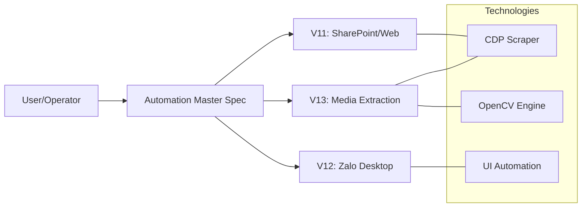

# MASTER SPECIFICATION: CES Academy Automation Suite
**High-Level Design & Strategic Architecture**

## 1. Mục tiêu kiến trúc (Project Objectives)
Bộ công cụ được thiết kế để giải quyết nhu cầu trích xuất dữ liệu đa nền tảng (SharePoint, Zalo, Facebook) với độ chính xác cao và xử lý các rào cản về bản quyền (View-only) hoặc giới hạn kỹ thuật (No API).

## 2. Khung giải pháp (Solution Framework)
Kiến trúc tổng thể dựa trên 3 trụ cột kỹ thuật:

### A. Web Automation Interface (CDP & Browser Debugging)
- **Cơ chế:** Kết nối trực tiếp vào trình duyệt qua Port `9222`.
- **Ứng dụng:** Trích xuất file từ SharePoint (V11) và cào link Media FB Group (V13).

### B. Native Desktop Interaction (UI Automation)
- **Cơ chế:** Điều khiển chuột/phím và lấy tiêu điểm an toàn (Safe Focus).
- **Ứng dụng:** Cuộn và chụp ảnh hội thoại Zalo Desktop (V12).

### C. Computer Vision & Intelligent Detection (Image Processing)
- **Cơ chế:** Sử dụng OpenCV (Template Matching) và Image Difference (Mắt thần).
- **Ứng dụng:** Nhận diện nút tải về và nhận diện điểm dừng hội thoại (End-of-chat).

## 3. Bản đồ dự án (Project Map & Navigation)

| Version | Folder | Mô tả kỹ thuật |
| :--- | :--- | :--- |
| **V11** | [Project_V11_SharePoint_Capture/](./Project_V11_SharePoint_Capture/) | Tự động hóa trình duyệt cào PDF SharePoint |
| **V12** | [Project_V12_Zalo_Screenshot/](./Project_V12_Zalo_Screenshot/) | Engine chụp ảnh màn hình sạch & Ghép PDF |
| **V13** | [Project_V13_Media_Downloader/](./Project_V13_Media_Downloader/) | Tải file/hình gốc dùng OpenCV và CDP Scraper |

## 4. Nguyên lý cốt lõi (Core Principles)
- **Safe Mode:** Click tại vùng an toàn (Safe Edge) để tránh kích hoạt các link ngầm.
- **Deduplication:** Khử trùng lặp trong quá trình cào Media và chụp ảnh.
- **Portability:** Toàn bộ công cụ chạy trên Python Portable và GitHub CLI cục bộ.

---
## 🔄 Sơ đồ kiến trúc tổng quát

---
*📍 Được duy trì bởi Antigravity Agent. Cập nhật cuối: 19/04/2026.*
