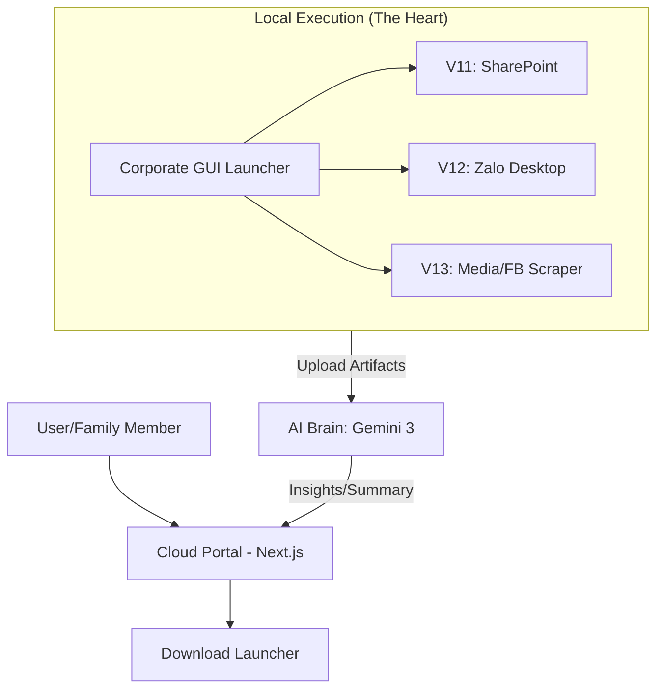

# MASTER SPECIFICATION: CES Academy Unified Automation Platform
**High-Level Design & Strategic Architecture**

## 1. Mục tiêu kiến trúc (Project Objectives)
Hệ thống được thiết kế để trở thành một nền tảng hợp nhất (Unified Platform), không chỉ dừng lại ở các script automation rời rạc mà là một hệ sinh thái Hybrid:
- **Execute Local:** Thực thi các tác vụ cào dữ liệu qua Dashboard GUI chuyên nghiệp.
- **Process & Share (Web):** Lưu trữ, quản lý và xử lý dữ liệu tập trung qua Cloud Portal tích hợp AI.

## 2. Khung giải pháp (Solution Framework)
Kiến trúc tổng thể chuyển dịch sang mô hình **Hybrid Automation Platform**:

### A. The Local Engine (Cỗ máy thực thi)
- **Cơ chế:** Portable Python Environment + Corporate GUI Launcher.
- **Tính năng:** Điều khiển CDP (V11/V13), Desktop UI (V12), và OpenCV Downloader.

### B. The Cloud Portal (Next.js Hub)
- **Cơ chế:** Website triển khai trên Vercel, đóng vai trò là "Tổng hành dinh".
- **Tính năng:** Quản lý phiên bản, cung cấp tài liệu hướng dẫn, và là nơi Upload/Xử lý dữ liệu.

### C. The AI Brain (Gemini 3 Integration)
- **Cơ chế:** Google AI Studio / Gemini API.
- **Tính năng:** OCR dữ liệu từ Zalo/Facebook, Tóm tắt nội dung, Nhận diện thực thể và xu hướng trong Media cào được.

## 3. Bản đồ dự án (Project Roadmap & Versioning)

| Giai đoạn | Module | Trạng thái | Mô tả chuyên sâu |
| :--- | :--- | :--- | :--- |
| **Legacy** | **V10** | Hoàn thành | Capture tài liệu Web sạch bằng CSS Injection. |
| **Current** | **V11 - V13** | Mixed | V12 đã validate test run; V13 Facebook cần UAT; V11 skeleton; V13 Zalo bị quarantine. |
| **Unified** | **HUB (Local)** | In-Dev | Giao diện Corporate GUI (`launcher_gui.py`) gom các module. |
| **Platform** | **Portal (Web)** | Planning | Next.js Landing Page & AI Workspace để chia sẻ và xử lý DL. |

## 4. Nguyên lý cốt lõi (Core Principles)
- **Zero-Install:** Người dùng không cần cài đặt môi trường phức tạp (Portable first).
- **Stealth Automation:** Giả lập thao tác người dùng tự nhiên (Mouse Wheel, Safe Clicks).
- **Intelligence-First:** Dữ liệu sau khi cào phải được AI chuyển hóa thành thông tin có giá trị.
- **Sidecar-First AI:** Trước khi có full Portal, mỗi artifact nên có AI sidecar Markdown/JSON để tóm tắt, bóc tách nguyên văn, phân tích tone, CTA, action item và link second brain.

---
## 🔄 Sơ đồ kiến trúc Hybrid Platform

---
*📍 Được duy trì bởi Antigravity Agent. Cập nhật tiến hóa nền tảng: 20/04/2026.*
