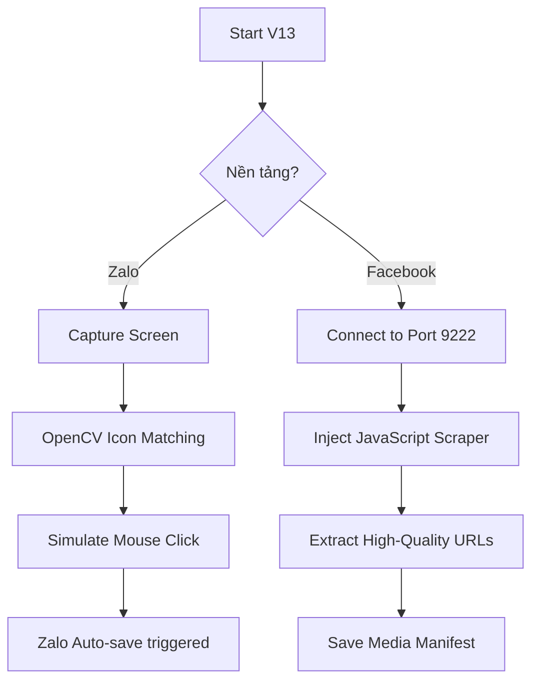

# Project V13 - Multi-Platform Media Extractor
**Technical Specification & Operation Manual**

## 1. Kiến trúc tổng quan (Architecture Overview)
Project V13 được thiết kế để vượt qua các rào cản về API của Zalo và Facebook bằng cách sử dụng hai kỹ thuật can thiệp trực tiếp:
1.  **Thị giác máy tính (CV):** Nhận diện các thành phần giao diện (UI Elements) để tương tác.
2.  **Giao thức gỡ lỗi Chrome (CDP):** Trích xuất dữ liệu trực tiếp từ bộ nhớ đệm và cây DOM của trình duyệt đang chạy.

## 2. Zalo Media Downloader (OpenCV Engine)
### Cơ chế hoạt động
- **Template Matching:** Sử dụng thuật toán `cv2.matchTemplate` để so khớp ảnh mẫu `zalo_download_icon.png` với ảnh chụp màn hình Zalo Desktop hiện tại.
- **Deduplication:** Sử dụng ngưỡng khoảng cách 25 pixel để loại bỏ các điểm trùng lặp, đảm bảo mỗi icon chỉ được click một lần.
- **Cấu hình tối ưu:**
    - Ngưỡng chính xác (Threshold): `0.8`.
    - Vùng quét (Scanning Region): Giới hạn trong vùng chat (V4 Tight Crop) để tránh click nhầm vào Menu hoặc thanh tìm kiếm.

### ⚠️ Khuyến nghị vận hành
Để đạt tốc độ cao nhất, người dùng nên bật tính năng **"Tự động lưu file vào thư mục"** trong cài đặt Zalo Desktop. Việc này giúp bỏ qua bước hiện hộp thoại "Save As" của Windows.

## 3. Facebook Group Scraper (CDP Engine)
### Cơ chế hoạt động
- **Can thiệp Session:** Kết nối trực tiếp vào trình duyệt đang mở thông qua cổng `9222`.
- **DOM Extraction:** Thực thi Javascript (`Runtime.evaluate`) bên trong ngữ cảnh của trang Facebook để tìm tất cả các URL chứa chuỗi `fbcdn.net`.
- **Phân loại Media:** Tự động phân tách giữa hình ảnh (`img`) và các tập tin đính kèm (`a href`).

### ⚙️ Hướng dẫn cấu hình Chrome Debug Port
Để script có thể kết nối, anh cần khởi động Chrome (hoặc Edge) với tham số:
`--remote-debugging-port=9222`

## 4. Danh sách tệp tin (File Manifest)
- `v13_zalo_media_downloader.py`: Script điều khiển tải Media Zalo.
- `v13_fb_media_downloader.py`: Script cào Media Facebook Group.
- `v13_template_extractor.py`: Công cụ hỗ trợ cắt Icon làm mẫu cho OpenCV.

---
## 🔄 Sơ đồ luồng (Workflow)

---
*📍 Tài liệu được biên soạn ngày 19/04/2026 bởi Antigravity Agent.*
